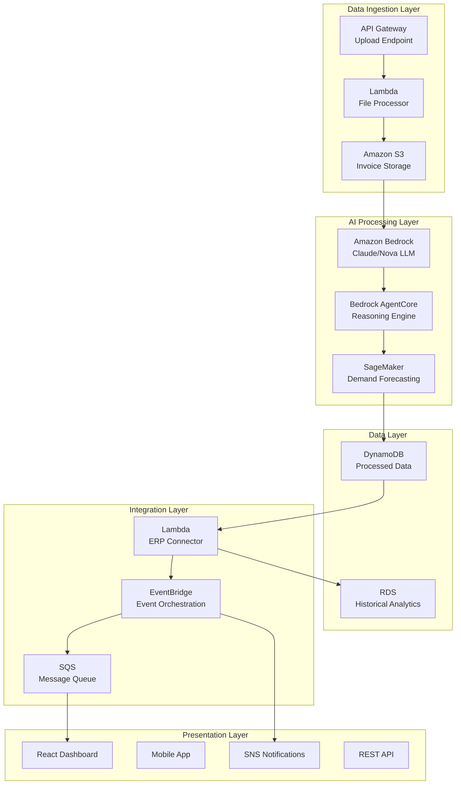

# Design Document

## Overview

The Intelligent Inventory Replenishment Agent is built as a serverless, event-driven system on AWS that leverages Amazon Bedrock for AI reasoning, Amazon SageMaker for machine learning models, and various AWS services for data processing and integration. The system processes invoice data through automated pipelines, applies predictive analytics to generate replenishment recommendations, and provides real-time monitoring capabilities.

The architecture follows a microservices pattern with clear separation of concerns: data ingestion, processing, AI inference, and external integrations. This design ensures scalability, maintainability, and cost-effectiveness while meeting the hackathon's requirements for autonomous AI agent capabilities.

## Architecture



## Components and Interfaces

### 1. Invoice Processing Engine

**Purpose**: Extracts and normalizes data from sales and purchase invoices using Amazon Bedrock's document understanding capabilities.

**Key Components**:
- **Document Parser**: Uses Bedrock's Claude model to extract structured data from various invoice formats (PDF, images, CSV)
- **Data Validator**: Ensures extracted data meets quality standards and business rules
- **Format Normalizer**: Converts diverse invoice formats into standardized data structures

**Interfaces**:
```typescript
interface InvoiceData {
  invoiceId: string;
  type: 'sales' | 'purchase';
  date: Date;
  supplier?: string;
  customer?: string;
  lineItems: LineItem[];
}

interface LineItem {
  partNumber: string;
  description: string;
  quantity: number;
  unitPrice: number;
  totalAmount: number;
}
```

### 2. AI Reasoning Engine (Bedrock AgentCore)

**Purpose**: Orchestrates the decision-making process for inventory replenishment using Amazon Bedrock AgentCore primitives.

**Key Components**:
- **Demand Analyzer**: Processes historical sales data to identify patterns and trends
- **Supplier Evaluator**: Analyzes purchase data to rank suppliers by performance metrics
- **Replenishment Optimizer**: Generates optimal reorder recommendations using AI reasoning

**AgentCore Primitives Used**:
- **Planning**: Breaks down inventory analysis into sequential tasks
- **Tool Use**: Integrates with external APIs and databases
- **Memory**: Maintains context across multiple analysis sessions
- **Reasoning**: Applies business logic to generate recommendations

### 3. Predictive Analytics Module

**Purpose**: Leverages Amazon SageMaker to build and deploy machine learning models for demand forecasting.

**Key Components**:
- **Time Series Forecaster**: Predicts future demand using historical sales patterns
- **Seasonality Detector**: Identifies seasonal trends and cyclical patterns
- **Anomaly Detector**: Flags unusual demand spikes or drops for investigation

**ML Models**:
- **DeepAR**: For probabilistic demand forecasting with uncertainty quantification
- **Prophet**: For trend and seasonality analysis
- **Random Forest**: For supplier performance prediction

### 4. Integration Hub

**Purpose**: Connects with external ERP systems and inventory management platforms.

**Key Components**:
- **API Connector**: Handles REST/SOAP integrations with various ERP systems
- **Data Synchronizer**: Ensures real-time inventory level updates
- **Order Generator**: Creates purchase orders in external systems

**Supported Integrations**:
- SAP, Oracle ERP, Microsoft Dynamics
- Generic REST APIs
- CSV/Excel file exports

### 5. User Interface Layer

**Purpose**: Provides intuitive interfaces for different user roles to interact with the AI agent and view recommendations.

**Key Components**:

#### Web Dashboard (React + AWS Amplify)
- **Executive Overview**: High-level KPIs, cost savings, inventory turnover metrics
- **Inventory Manager View**: Current stock levels, reorder alerts, supplier performance
- **Procurement Dashboard**: Purchase recommendations, supplier comparisons, cost analysis
- **Analytics Portal**: Demand forecasting charts, trend analysis, historical performance

#### Mobile Application (React Native)
- **Quick Alerts**: Push notifications for critical stock levels
- **Approval Workflow**: Mobile approval for purchase recommendations
- **Barcode Scanner**: Quick inventory updates and part lookup
- **Offline Capability**: Basic functionality when connectivity is limited

#### Key UI Features:
- **Interactive Charts**: Real-time demand forecasting and trend visualization using Chart.js/D3
- **Drag-and-Drop Upload**: Bulk invoice upload with progress tracking
- **Smart Filters**: AI-powered search and filtering across parts and suppliers
- **Approval Workflows**: Multi-level approval process for purchase orders
- **Customizable Alerts**: User-defined thresholds and notification preferences
- **Export Capabilities**: PDF reports, Excel exports, API data access

#### User Experience Design:
- **Role-Based Access**: Different interfaces optimized for warehouse managers, procurement specialists, executives
- **Progressive Disclosure**: Simple overview with drill-down capabilities for detailed analysis
- **Real-Time Updates**: WebSocket connections for live inventory and recommendation updates
- **Responsive Design**: Optimized for desktop, tablet, and mobile devices

## Data Models

### Core Entities

```typescript
// Spare Part Master Data
interface SparePart {
  partNumber: string;
  description: string;
  category: string;
  unitOfMeasure: string;
  currentStock: number;
  safetyStock: number;
  reorderPoint: number;
  leadTimeDays: number;
}

// Demand Forecast
interface DemandForecast {
  partNumber: string;
  forecastDate: Date;
  predictedDemand: number;
  confidenceInterval: {
    lower: number;
    upper: number;
  };
  seasonalityFactor: number;
}

// Replenishment Recommendation
interface ReplenishmentRecommendation {
  partNumber: string;
  recommendedQuantity: number;
  suggestedOrderDate: Date;
  preferredSupplier: string;
  estimatedCost: number;
  urgencyLevel: 'low' | 'medium' | 'high' | 'critical';
  reasoning: string;
}

// Supplier Performance
interface SupplierMetrics {
  supplierId: string;
  averageLeadTime: number;
  onTimeDeliveryRate: number;
  priceStability: number;
  qualityRating: number;
  lastOrderDate: Date;
}
```

### Data Storage Strategy

- **DynamoDB**: Real-time operational data (current inventory, active recommendations)
- **RDS (PostgreSQL)**: Historical analytics and complex queries
- **S3**: Raw invoice files and processed datasets for ML training

## Error Handling

### 1. Data Processing Errors

- **Invalid Invoice Format**: Graceful degradation with manual review queue
- **Missing Critical Data**: Partial processing with flagged incomplete records
- **Duplicate Detection**: Automatic deduplication with audit logging

### 2. AI Model Errors

- **Prediction Failures**: Fallback to statistical methods or historical averages
- **Low Confidence Predictions**: Flag for manual review with uncertainty indicators
- **Model Drift**: Automatic retraining triggers when accuracy drops below thresholds

### 3. Integration Failures

- **ERP Connection Issues**: Queue operations for retry with exponential backoff
- **API Rate Limits**: Implement throttling and request queuing
- **Data Sync Conflicts**: Conflict resolution with timestamp-based precedence

### 4. System Resilience

- **Lambda Timeouts**: Break large processing jobs into smaller chunks
- **DynamoDB Throttling**: Implement adaptive capacity and retry logic
- **Cross-Region Failover**: Multi-AZ deployment for high availability

## Testing Strategy

### 1. Unit Testing

- **Invoice Parser**: Test with various invoice formats and edge cases
- **ML Models**: Validate prediction accuracy against historical data
- **Business Logic**: Test replenishment calculation algorithms

### 2. Integration Testing

- **End-to-End Workflows**: Test complete invoice-to-recommendation pipeline
- **External API Mocking**: Simulate ERP system responses
- **Data Consistency**: Verify data integrity across all storage layers

### 3. Performance Testing

- **Load Testing**: Process large batches of invoices under peak conditions
- **Latency Testing**: Ensure real-time recommendation generation meets SLA
- **Cost Optimization**: Monitor AWS service usage and optimize for cost efficiency

### 4. AI Model Validation

- **Backtesting**: Validate predictions against historical outcomes
- **A/B Testing**: Compare different model approaches for accuracy
- **Bias Detection**: Ensure fair treatment across different part categories and suppliers

### 5. Security Testing

- **Data Privacy**: Ensure sensitive invoice data is properly encrypted
- **Access Control**: Validate IAM policies and API authentication
- **Audit Compliance**: Test logging and monitoring capabilities